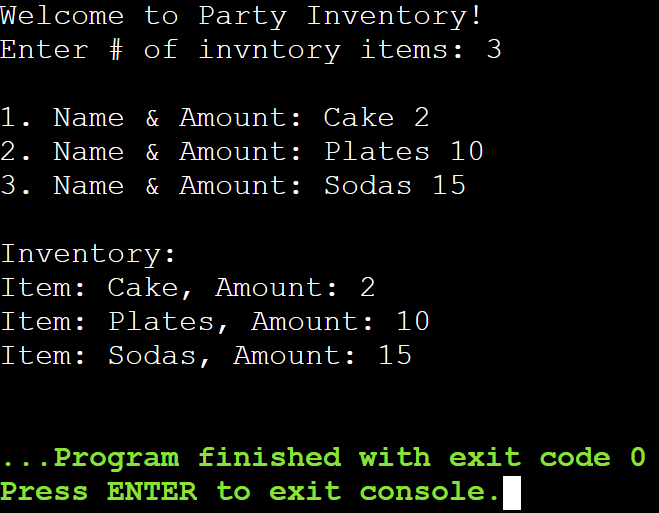

# Lab Assignment 10

In this lab you will practice working with arrays.

Same as the previous labs, you need to set up your workspace (class and main() method).

## Let's get started!

First, let's look at the name of our .java file in the `src/` directory and name your class accordingly and remember to make it `public`. Next, **create your main() method inside your class**.

Now let's begin!

### Arrays

In Java arrays are written a little differently than in C++.

Arrays are used to store multiple values of the same type into a single variable. 

Arrays are declared by placing the `[ ]` **next to its data type** or **next to its identifier**.

**Declaring an array in Java:**
```java
int[] num_array;
// or
String word_array[];
```

In Java we don't have to allocate memory when declaring an array. We can allocate memory either during the declaration or afterwards using `new`.

**Allocating Memory:**
```java
// During Declaration
String[] text_array = new String[5];

// After Declaration
float[] nums_array;
nums_array = new float[5];
```

Similarly, you can initialize (assign literal values) to your array either during the declaration using `{ }` or afterwards by assigning values individually using `[ ]`.

**Initializing:**
```java
// During Declaration
String[] car_array = {"Toyota", "Ford", "Chevy"};

// After Declaration
String[] color_array = new String[3];
color_array[0] = "Blue";
color_array[1] = "Red";
color_array[2] = "Green";
```

For more information on arrays in Java visit: https://www.w3schools.com/java/java_arrays.asp

## Your Assignment

### Party Inventory

Create a birthday party planner program to **keep inventory of party supplies** using arrays.

Prompt the user to **input how many inventory items are needed**.

Next, have the user input the **name of the item** and **how many of each** are needed.

Lastly, **display back the items** in an organized manner.

**Expected Output:**



## Submit your assignment

To submit your lab assignment click on the **Source Control** icon (3 circles with 2 lines) on your leftside navbar. Next, click on the **+** symbol next to **Changes** to stage your changes. Lastly, add a commit message (ex: "First commit") and click **Commit** then **Sync Changes**. And you're done!
